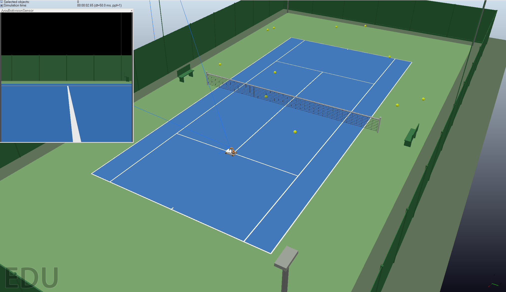
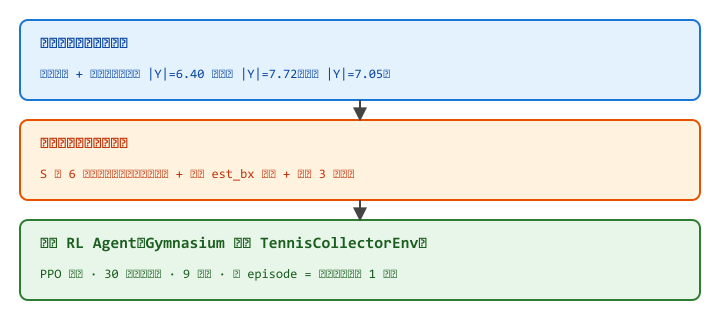
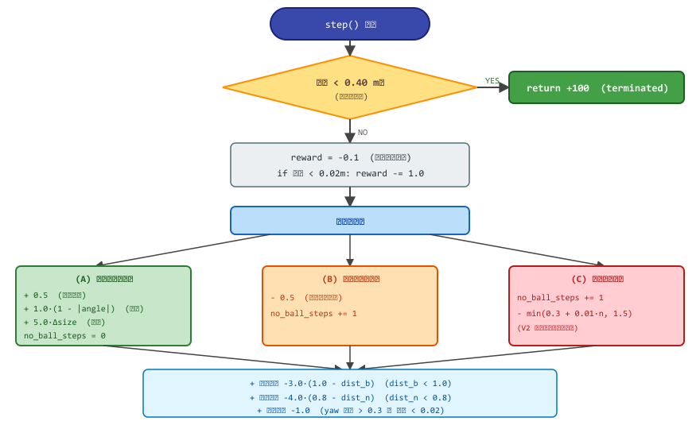
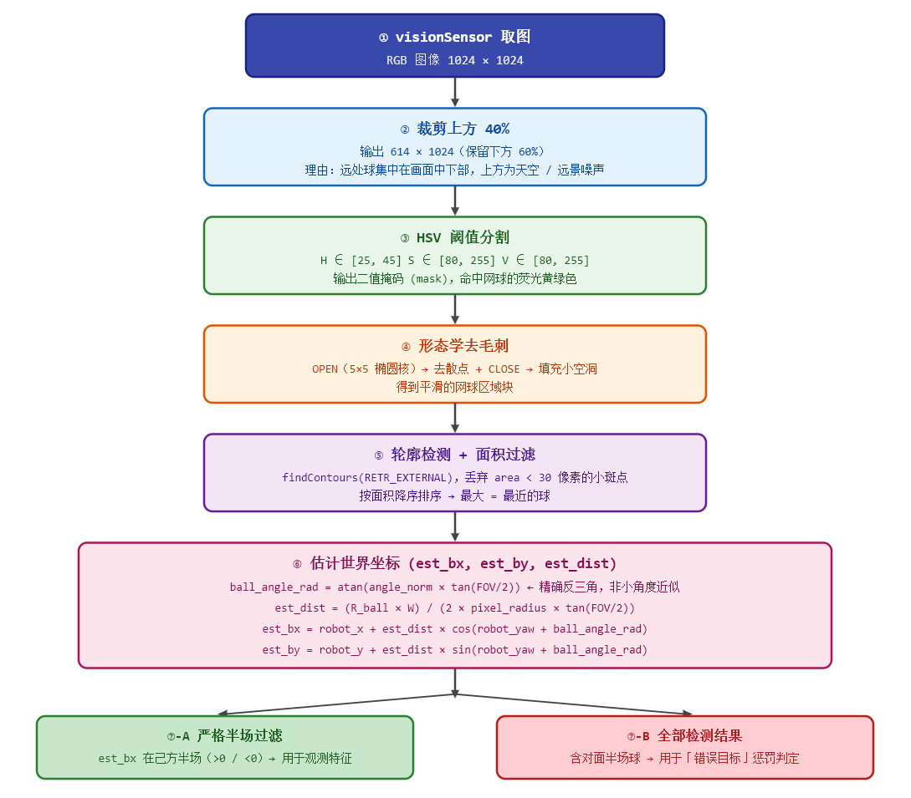
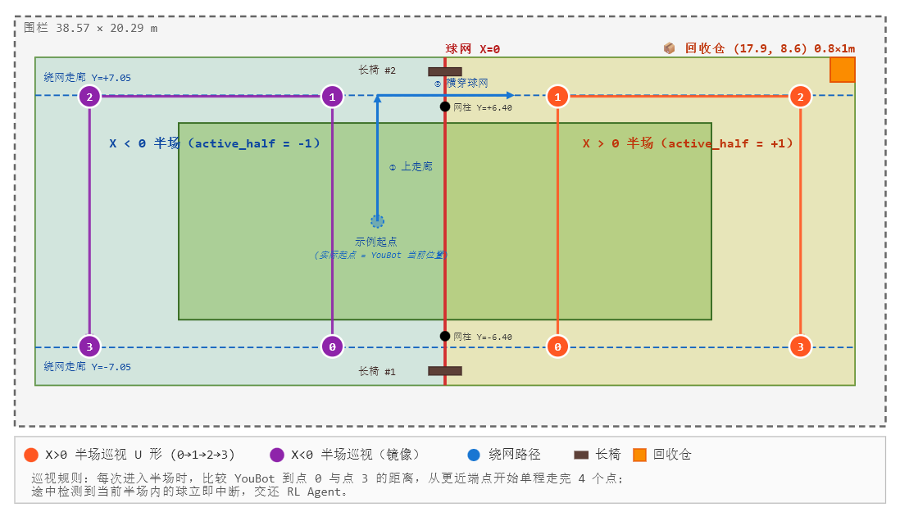
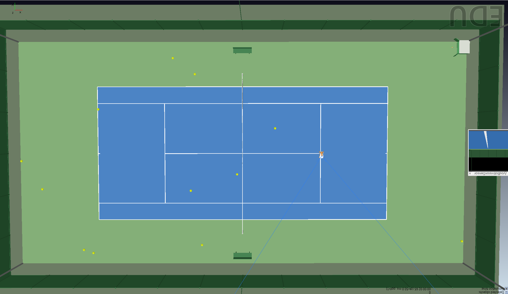

# 🎾 TennisBallsCollector — 基于仿真平台 CoppeliaSim 的视觉强化学习 YouBot 网球收集机器人

<p align="center">
  
  
  
  
  
  
  
</p>

> **简介**：在 CoppeliaSim 真实比例（1:1）网球场内，用一台仅装备 **单目摄像头(Vision Sensor)** 的 KUKA YouBot 移动机器人，通过 PPO 强化学习自主完成"巡场 → 发现 → 接近 → 收集"全流程，最终成功率稳定在 **88%~92%**。

## 📖 项目简介

本项目作为一个课程项目，实现了一个 **完整工程化** 的视觉驱动强化学习捡网球系统，核心特点：

- **视觉感知**：YouBot 仅依赖一个前向 RGB visionSensor（1024×1024），不依赖深度信息，仅依靠 HSV 颜色分割 + 轮廓像素面积估计距离与方位。
- **半场专注式 RL**：将"全场捡球"这一巨型任务拆解为"半场内单球收集"的 Gym 环境（一个 episode = 在当前半场内消除一个球），使 PPO 能在合理时间内收敛。
- **规则 + RL 混合架构**：底层 RL Agent 负责视觉闭环捡球，中层规则代码负责 C 形 4 点半场巡视，顶层规则代码负责绕网切换半场，各层职责分明。
- **稠密奖励工程**：精心设计的多分支奖励函数（视觉引导 + 视野新鲜度 + 边界/球网梯度 + 摇头检测 + 多终止判据），有效抑制原地摇头、贴网、卡边界等局部最优行为。
- **生产级训练设施**：跨 resume 持久化的统计回调、滚动窗口最佳模型保存、学习率与熵系数线性衰减、动态网球重生成（避免位置过拟合）、Checkpoint 规范化。
- **从全局坐标作弊版到视觉版**：项目历经 V0~V4 多代演进，每一代的核心难点（万向锁、贴网震荡、视觉噪声、resume 统计归零、绕网撞椅子）都有详细的工程解法记录。

整体目标是**完整验证视觉 RL 在复杂仿真环境中的可行性**，并积累一套可复用的 Gym 环境/奖励工程/部署流程模板。

### 仿真场景参考图


## ✨ 主要特性

| 模块 | 关键能力                                                                 |
|------|----------------------------------------------------------------------|
| 🎮 仿真环境 | CoppeliaSim 4.10.0 + ZMQ stepping 同步模式，通过 `sim.step()` 严格驱动物理与 agent |
| 👁️ 感知 | OpenCV HSV → 形态学 → 轮廓 → 面积排序 → 像素面积距离反算 + 半场严格过滤                     |
| 🧠 RL 算法 | Stable-Baselines3 PPO（MlpPolicy，pi/vf=[128,128]），CPU 训练即可            |
| 🎯 状态空间 | 10 维语义特征 × 3 帧堆叠 = 30 维（避免直接喂图像，CPU 训练成本极低）                          |
| 🕹️ 动作空间 | V2 共 9 个离散动作，含 2 个后退动作解决"背后球只能摇头"的局部最优                               |
| 🏆 奖励函数 | 稀疏 +100 / 稠密引导 / 视野新鲜度 / 边界球网梯度 / 摇头 / 终止性 -10                       |
| 🚀 训练设施 | 跨 resume 状态持久化、自动最佳模型保存、学习率/熵系数线性衰减                                  |
| 🤖 部署系统 | RL + 规则混合调度，绕网两段式路径 + C 形 4 点巡视 + 卡顿兜底                               |


## 🏛️ 系统架构

### 整体通信框架

```
CoppeliaSim 仿真环境（4.10.0）
        ↕ ZMQ Remote API
Python RL 训练 / 部署 (PPO 算法)
```

### 三层分层架构（部署时）



只有"在当前半场内找到并消除一个球"这一最难的视觉感知 + 闭环运动控制部分交给 PPO 学习；
全场调度、绕网、巡视等几何明确的部分由规则代码处理，避免无谓增加 RL 学习负担。

## 📁 项目结构

```
Tennis_Collector/
├── scene/
│   ├── scene.ttt                          -- 可直接使用的场景文件
│   ├── tennis_scene_latest.lua            -- 创建场景脚本 
│   └── Tennis_Generate.lua                -- 随机位置网球生成脚本
│
├── docs/
│   ├── svg/                               -- README 流程图 / 场地图的 SVG 源码（可编辑）
│   └── images/                            -- 同名 PNG 导出
│
├── tennis_rl_env.py                       -- RL 环境 V1（7 动作）
├── tennis_rl_env2.py                      -- RL 环境 V2（9 动作 + 视野新鲜度）
│
├── train.py                               -- PPO 训练脚本 V1
├── train2.py                              -- PPO 训练脚本 V2（学习率/熵衰减）
│
├── Deploy_collector.py                    -- 部署脚本 V1
├── Deploy_Collector2.py                   -- 部署脚本 V2
│
├── TennisGlobalLocating_elimate_with_dist.py  -- 初代全局坐标作弊版
├── Tennis_Spawner_Script_test.py          -- 网球生成lua脚本测试
├── async_saver.py                         -- 异步模型保存工具
│
├── logs/  logs_v2/                        -- TensorBoard 训练日志
├── models/  models_v2/                    -- 训练缓存与最佳模型
├── requirements.txt
└── README.md
```

## 🚀 快速开始

### 1. 环境准备

| 依赖 | 版本要求 |
|------|----------|
| CoppeliaSim | 4.10.0+（[官方下载](https://www.coppeliarobotics.com/)） |
| Python | 3.11.15（开发测试版本） |
| 操作系统 | Windows / Linux |

```bash
# 克隆仓库
git clone https://github.com/uMemory/CollectTennisBalls_RL_CoppeliaSim.git
cd CollectTennisBalls_RL_CoppeliaSim

# (推荐) 创建独立环境
conda create -n tennis python=3.11.15 -y
conda activate tennis

# 安装依赖
pip install -r requirements.txt
```

### 2. 启动 CoppeliaSim 场景

1. 打开 CoppeliaSim，加载 `scene/scene.ttt`
2. **挂载网球生成脚本（关键步骤，否则训练中无法自动重生成网球）**：
   - 在场景层级中找到 **收集箱（`Bin_Entry` / `Bin_Base`）** 对象
   - 右键 → `Add` → `Associated child script` → 选择 **`Customization`** 类型 + **`Non-threaded`** 模式 + **`Lua`** 语言
   - 该脚本必须作为收集箱的 **子 subframe**（关联子脚本），脚本内容粘贴 `scene/Tennis_Generate.lua`
   - 这样 Python 端才能通过 `sim.callScriptFunction('spawnBalls', ...)` 在训练运行时远程调用生成函数，可通过运行Tennis_Spawner_Script_test.py测试是否可用。
   - **仓库自带 `scene.ttt` 已预挂载该脚本，直接使用可跳过本步**
3. 点 **Play ▶** 启动仿真（仿真处于运行中即可，stepping 模式由 Python 端自动接管）


### 3. 启动训练

```bash
python train2.py
```

> ⚠️ **首次训练建议**：从头训练约 300k~500k 步，单环境 i7-13700H CPU 速度约 4~7 fps，预估 1w setps/ 0.5h。可中途 `Ctrl+C` 安全保存并 resume。
>
> 训练过程中可在另一终端运行 `tensorboard --logdir ./logs_v2 --port 6006` 监控曲线。
> 评估、resume、部署等其他命令见文末 [🗒️ 常用命令速查](#-常用命令速查)。

## 📋 项目概述（技术摘要）

- **仿真平台**：CoppeliaSim 4.10.0 + ZMQ Remote API（stepping 同步模式）
- **RL 算法**：Stable-Baselines3 PPO（MlpPolicy）
- **感知方式**：单目 visionSensor + HSV 颜色分割（无深度信息，仅靠像素面积估算距离）
- **最终效果**：成功率稳定在 **88%~92%**，支持长时间 resume 训练，具备较好的鲁棒性

项目从**全局坐标作弊版**开始，经过多次重大迭代，最终形成一套**工程化程度较高**的 RL 解决方案。

---

## 🧠 核心环境设计（TennisCollectorEnv）

环境实现遵循 Gymnasium API，单环境直连 CoppeliaSim（不使用 VecEnv，避免多 ZMQ 连接冲突），仿真使用 stepping 同步模式保证 agent 与物理引擎严格对齐。

### 1. 状态空间（Observation Space）

观测空间为 **10 维单帧语义特征 × 3 帧堆叠 = 30 维**连续向量（`Box(low=-1, high=1, shape=(30,))`），用 3 帧堆叠让网络感知到运动趋势（如球在画面中变大 = 正在靠近）。

不直接喂图像（CNN 训练慢、连续 ZMQ 取图开销大），而是先通过 OpenCV 提取语义特征，使 PPO 网络可以使用轻量 MLP（`pi=[128,128]`、`vf=[128,128]`）。

**10 维单帧特征**：

| 维度 | 名称              | 含义                                               | 取值范围   |
|------|-------------------|----------------------------------------------------|------------|
| 0    | `ball_detected`   | 活跃半场内是否检测到网球                            | {0, 1}     |
| 1    | `ball_angle`      | 最近网球在图像中的归一化水平偏角                    | [-1, 1]    |
| 2    | `ball_size`       | 像素面积归一化（距离的反向代理）                    | [0, 1]     |
| 3    | `ball_count`      | 活跃半场内可见网球数量（按 `NORM_COUNT=6` 归一化） | [0, 1]     |
| 4    | `ball_reachable`  | 估计球世界坐标是否在己方半场（宽松判据，容忍 0.5m）| {0, 1}     |
| 5    | `norm_rx`         | YouBot X 坐标归一化（`/HALF_COURT_X_MAX≈18.3`）   | [-1, 1]    |
| 6    | `norm_ry`         | YouBot Y 坐标归一化（`/HALF_COURT_Y_MAX≈9.1`）    | [-1, 1]    |
| 7    | `norm_yaw`        | YouBot 航向角归一化（`/π`）                        | [-1, 1]    |
| 8    | `norm_net`        | 到球网（X=0）的归一化距离                          | [0, 1]     |
| 9    | `norm_bound`      | 到场地最近边界的归一化距离（按 3.0 m 截断）         | [0, 1]     |

**关键点**：
- `ball_angle` 由轮廓质心 `cx` 直接通过 `(cx - W/2)/(W/2)` 得到，不受图像垂直裁剪影响
- `ball_size` = 轮廓像素面积 / (614 × 1024 × 0.05)，作为距离代理
- 半场过滤使用**动态严格判据**：`margin = est_dist × 0.35 × (1 − |rx|/3.0)`，靠近球网（\|rx\| < 3m）时 margin 随距离不确定性线性增大，球必须满足 `est_bx > margin` 才算在己方半场。远离球网时 margin=0，退化为 `est_bx > 0`，不影响原有行为
- `ball_reachable` 使用固定**宽松判据** (`est_bx > -0.5`) 给可达标志，避免误杀网边球

### 2. 动作空间（Action Space）

离散动作空间，每个动作连续执行 `ACTION_REPEAT=4` 个仿真步，给电机充分时间产生位移，避免单步动作信号过短被物理引擎吞掉。

底层运动学采用麦克纳姆轮"差速 + 推力"组合，每个动作映射为四个轮速：

```
v_fl = forward + turn       v_fr = forward - turn
v_rl = forward + turn       v_rr = forward - turn
```

#### 环境 V1（ `tennis_rl_env.py`）：7 个离散动作

| ID | 名称              | forward | turn | 说明           |
|----|-------------------|---------|------|----------------|
| 0  | FORWARD           | 5~6     | 0.0  | 直行前进       |
| 1  | FORWARD_LEFT      | 4.0     | +1.5 | 左前弧线前进   |
| 2  | FORWARD_RIGHT     | 4.0     | -1.5 | 右前弧线前进   |
| 3  | TURN_LEFT         | 0.0     | +2.5 | 小角度左原地转 |
| 4  | TURN_RIGHT        | 0.0     | -2.5 | 小角度右原地转 |
| 5  | TURN_LEFT_LARGE   | 0.0     | +5.0 | 大角度左原地转 |
| 6  | TURN_RIGHT_LARGE  | 0.0     | -5.0 | 大角度右原地转 |

#### 环境 V2（`tennis_rl_env2.py`）：9 个离散动作

V2 在 V1 基础上**新增 2 个后退动作**

| ID | 名称              | forward | turn | 说明           |
|----|-------------------|---------|------|----------------|
| 0~6| 同 V1             |         |      |                |
| 7  | BACKWARD          | -3.0    | 0.0  | 后退（V2 新增）|
| 8  | BACKWARD_TURN     | -3.0    | +1.5 | 后退 + 小转向  |

> **注意**：V2 的 9 维动作空间无法加载 V1 的 7 维模型 resume，需从头训练。

### 3. 奖励函数（Reward Shaping）

奖励函数是本项目最关键的工程难点。采用 **稠密引导 + 稀疏目标 + 多重惩罚** 三段式设计：

#### 单步奖励判定流程



> 终止性大惩罚（越网 / 卡边界 / 卡网）在判定流程之外另行触发，每次额外 `-10`。


#### (a) 稀疏大奖励 — 任务核心目标

| 事件                              | 奖励         |
|-----------------------------------|--------------|
| 成功消除网球（距离 < 0.40 m）     | **+100**     |

#### (b) 每步基础项

| 项目                              | 数值         | 触发条件                              |
|-----------------------------------|--------------|---------------------------------------|
| 时间惩罚                          | `-0.1`       | 每步固定                              |
| 静止惩罚                          | `-1.0`       | 单步位移 < 0.02 m                     |

#### (c) 视觉引导奖励 — 三种视野状态分情况处理

| 视野状态                                                    | 奖励组成                                                      |
|-------------------------------------------------------------|-----------------------------------------------------------|
| (i) 看到活跃半场内的球（`ball_in_half=True`）              | `+0.5` 移动奖励 `+ 1.0·(1-\|angle\|)` 角度对齐 `+ 5.0·Δsize` 接近增益 |
| (ii) 视野里只有对面半场的球（`any_visible && !ball_in_half`）| `-0.5` 强惩罚（比完全没看到更糟，避免 agent 注意错误目标）                      |
| (iii) 完全看不到球                                          | **V1**: `-0.3` 固定；**V2**: `-min(0.3 + 0.01·n, 1.5)` 视野新鲜度线性递增 |

> **V2 视野新鲜度（freshness penalty）**：连续 `n` 步看不到球，单步惩罚从 `-0.3` 线性增加到 `-1.5` 封顶。
> 设计目的：阻止 agent 通过"原地慢慢摇头"把单步惩罚摊薄到接近 0 的局部最优，强制其要么找到球要么主动探索。

#### (d) 边界 / 球网梯度惩罚

| 触发                              | 奖励公式                                  |
|-----------------------------------|-------------------------------------------|
| 距离边界 < 1.0 m                  | `-3.0 × (1.0 - dist_to_boundary)`        |
| 距离球网 < 0.8 m                  | `-4.0 × (0.8 - net_distance)`            |

梯度惩罚比硬性禁止更平滑，让 agent 学到"远离边界更安全"的连续偏好。

#### (e) 摇头惩罚（基于 frame stack 的滑动检测）

```
最近 3 帧 |yaw 变化| > 0.3 rad  且  位移 < 0.02 m  →  -1.0
```

#### (f) 终止性大惩罚

| 终止原因                          | 奖励      | 步数判据                |
|-----------------------------------|-----------|-------------------------|
| 越过球网（`crossed_net`）         | `-10`     | `|rx| 跨过 -0.3`        |
| 卡在边界                           | `-10`     | `dist_to_boundary < 0.3 且 单步位移 < 0.05` 连续 30 步 |
| 卡在网边                           | `-10`     | `net_distance < 0.3 且 单步位移 < 0.05` 连续 30 步 |
| 超时（无负值）                     | 0         | `step_count ≥ 500`     |

> 卡顿判据使用**双重条件**（位置接近 + 位移小），避免"追球过程中途经网边"被误判终止。

### 4. 终止与重置（Episode Lifecycle）

**Episode 终止条件**：
- 成功消除一个球（`terminated=True, success=True`）
- 越过球网 / 卡边界 / 卡网（`terminated=True, success=False`）
- 步数达到 500（`truncated=True`）

**Reset 流程**：
1. 检查活跃半场内球数；为 0 则切换到对面半场；全场都没球则调用 Lua `spawnBalls()` 重生成 12 个
2. YouBot 随机放置在活跃半场内（`x ∈ [2, X_MAX-1]`，`y ∈ [-Y_MAX+1, Y_MAX-1]`）
3. **姿态重置**：先恢复初始正常姿态 `_default_ori`（保证水平），再用四元数绕世界 Z 轴乘随机航向角 —— 彻底规避欧拉角重置导致的万向锁/翻车
4. 调用 `sim.resetDynamicObject()` 清除残余速度
5. 等 15 个仿真步让物理稳定，再用 3 个相同初始观测填满 frame buffer

**soft_reset（部署专用）**：不挪动 YouBot，仅清空 episode 状态与 frame buffer，供绕网/巡视后衔接 RL 捡球。

### 5. 视觉感知流水线



---

## ⚙️ PPO 训练配置

### 网络架构（MlpPolicy）

```
30 维 state → MLP[128, 128] → π(a|s)  (Actor, 输出 9 维 logits)
30 维 state → MLP[128, 128] → V(s)    (Critic, 输出标量)
```

参数量约 4 万级别，CPU 训练即可（视觉特征已经被 OpenCV 提取成 30 维向量，没必要上 GPU）。

### 超参数对照

| 超参数            | V1 (`train.py`)    | V2 (`train2.py`)                          |
|-------------------|--------------------|-------------------------------------------|
| `total_timesteps` | 500,000            | 500,000                                   |
| `learning_rate`   | `3e-4` 固定        | **`3e-4 → 1e-4` 线性衰减**                |
| `n_steps`         | 1024               | **2048**（更稳定的 advantage 估计）       |
| `batch_size`      | 64                 | 64                                        |
| `n_epochs`        | 10                 | 10                                        |
| `gamma`           | 0.99               | 0.99                                      |
| `gae_lambda`      | 0.95               | 0.95                                      |
| `clip_range`      | 0.2                | 0.2                                       |
| `ent_coef`        | `0.01` 固定        | **`0.01 → 0.003` 线性衰减**（自定义 Callback）|
| `vf_coef`         | 0.5                | 0.5                                       |
| `max_grad_norm`   | 0.5                | 0.5                                       |
| `device`          | cpu                | cpu                                       |
| `seed`            | 42                 | 42                                        |

### V2 关键改进：自定义 EntCoefScheduleCallback

SB3 原生不支持 `ent_coef` 作为 schedule（loss 公式要求标量），但 `PPO.train()` 每次都会重新读取 `self.ent_coef`，因此通过 `_on_rollout_start` 在每个 rollout 周期前动态写入新值即可实现衰减：

```python
def _on_rollout_start(self):
    progress = self.num_timesteps / self.total_timesteps
    self.model.ent_coef = self.start + (self.end - self.start) * progress
```

设计意图：训练初期高熵鼓励探索，后期低熵让策略收敛 —— 这是从 1e5 步以后才开始有效收益的关键 trick。

### 训练辅助回调

| Callback                  | 功能                                                      |
|---------------------------|-----------------------------------------------------------|
| `CheckpointCallback`      | 每 10,000 步保存一份 `ppo_tennis_*.zip`                  |
| `BestModelCallback`       | 每 5,000 步检查最近 50 局滚动平均奖励，超过历史最佳则覆盖保存 + 写 meta.json |
| `TrainingLogCallback`     | 每 10 episode 打印 Ep / mean / max / min / 成功率 / 当前 R / L |
| `EntCoefScheduleCallback` | V2 专属，按全局进度衰减 `ent_coef`                       |

所有 Callback 的状态（`episode_count` / `success_count` / `episode_rewards` / `best_mean_reward`）都通过 JSON 持久化，**resume 时全部继承**，统计数据跨多次 `learn()` 调用保持连续。

---

## 🔧 核心处理逻辑（环境内部）

- **视觉流水线**：图像 → 裁剪上方 40% → HSV 分割 → 形态学处理 → 轮廓检测 → 面积排序 → 距离/角度估计
- **半场训练机制**：固定活跃半场，无球时自动切换，全场无球时调用 Lua 脚本重新生成
- **终止条件**：成功消除、穿越球网、卡边界、卡网、超时（500 步）

---

## 🎮 运动控制方案的演进（关键技术挑战）

### 初期方案：麦克纳姆轮三元组控制
- 使用 `forward + turn` 两个参数生成四轮速度
- 优点：简单快速
- 缺点：转向侧滑严重，姿态控制不精确

### 中期方案：四元数直接控制
- 尝试直接设置 YouBot 朝向
- **重大问题**：**万向锁（Gimbal Lock）**，导致 YouBot 在某些角度剧烈抖动甚至翻车，训练极不稳定

### 最终方案（当前使用）：变换矩阵 + 四元数乘法
- 记录初始姿态（`_default_ori`）
- 重置时：**先恢复初始正常姿态**（保证水平）
- 再用**四元数乘法** `q_new = qz * quat` 只改变航向角
- 同时调用 `resetDynamicObject()` 清除残余速度
- 彻底解决万向锁问题，YouBot 重置姿态始终稳定

**初代全局坐标版本**（`TennisGlobalLocating_elimate_with_dist.py`）正是这一演进过程中的重要里程碑，它首次实现了**矩阵 yaw 提取 + 统一导航控制器**，为后续视觉版本奠定了可靠的运动控制基础。

---

## 🎾 自动网球生成脚本（解决模型迭代问题）

`scene/Tennis_Generate.lua` 必须**作为收集箱（`Bin_Entry`）的子 subframe 关联脚本**挂载，且具体属性如下：

| 配置项     | 取值              | 原因 |
|-----------|------------------|------|
| 脚本类型   | **Customization Script** | 随场景持久化保存，可被 `sim.callScriptFunction` 跨进程调用 |
| 执行模式   | **Non-threaded**         | 与仿真主循环同步，避免多线程下创建 Shape 出现时序竞争 |
| 语言       | **Lua**                  | CoppeliaSim 原生支持，`sim.*` API 零开销 |
| 宿主对象   | `Bin_Entry`（收集箱）    | Python 端通过 `sim.getObject('/Bin_Entry')` 获取脚本句柄 |

挂载后该脚本对外暴露 `spawnBalls(ball_count, seed)` 函数：

- Python 通过 `sim.callScriptFunction('spawnBalls', script_handle, [count, seed], [], [], '')` 远程调用
- 支持全场随机位置生成 + 避免网附近生成
- 每次全场无球时自动重新生成 12 个网球
- **核心意义**：彻底解决"固定位置训练导致过拟合以及捡球后网球彻底重场景中删除"的问题，保证每次训练球的位置都不一样

---

## 🛰️ 部署阶段（V2）

部署是规则代码 + RL Agent 的协作流程：

```
while 场上有球:
    1. RL Agent 在当前半场捡球（循环调用 env.step + model.predict）
    2. 连续看不到球或卡住 → 触发半场巡视
    3. 巡视确认当前半场清空 → 绕网切换到另一半场
    4. 重复
```

### 绕网（bypass_net）

> **动态起点**：bypass 没有固定的"绕网起点"，路径起点 = bypass 调用时 YouBot 当前位置（先调 `_escape_from_obstacle(safe_margin=1.5)` 脱困到安全位置后再读取）。下表两个 waypoint 都基于这个动态起点 (`rx`, `ry`) 推导。

| 段           | 路径点                                          | 几何含义                            |
|--------------|----------------------------------------------|-------------------------------------|
| WP1 安全离网 | `(sign(rx)·max(\|rx\|, 1.5), sign(ry)·7.05)` | 当前 X（或最少离网 1.5m）+ 当前 Y 同侧的走廊 Y=±7.05 |
| WP2 横穿 X=0 | `(target_half·3.0, sign(ry)·7.05)`           | 沿走廊横穿到目标半场 X=±3 |

走廊位于网柱（\|Y\|=6.40）与椅子（\|Y\|≥7.72）之间。

**典型走法举例**：

| YouBot 当前位置 | bypass_y | rx_safe | WP1 | WP2 |
|-----------------|----------|---------|-----|-----|
| (-3, 0) | +7.05 | -3 | (-3, +7.05) 纵向上走廊 | (+3, +7.05) 横穿 |
| (-0.5, 0) | +7.05 | -1.5 | (-1.5, +7.05) 斜走 | (+3, +7.05) 横穿 |
| (-7, -3) | -7.05 | -7 | (-7, -7.05) 下走廊 | (+3, -7.05) 横穿 |

### 半场巡视（patrol_half）

C 形 4 路径点（近网列 X=±5m + 底线列 X=±15.785m × 上下两侧 Y=±7m）单程扫描，从离 YouBot 更近的端点切入。

**点位定义与路径方向**：

| 编号 | 坐标 | 角色 |
|------|------|------|
| **0** | (x_near, Y=-7) | ★ 端点（近网 Y- 侧） |
| 1 | (x_far, Y=-7)  | 底线 Y- |
| 2 | (x_far, Y=+7)  | 底线 Y+ |
| **3** | (x_near, Y=+7) | ★ 端点（近网 Y+ 侧） |

| YouBot 起始位置 | 路径方向 | 终点 |
|-----------------|----------|------|
| 离 0 更近 | 0 → 1 → 2 → 3 | 3（近网 Y+） |
| 离 3 更近 | 3 → 2 → 1 → 0 | 0（近网 Y-） |

**两个端点都在近网侧** —— 巡视终点天然衔接绕网起点（无需返程）。

> **S 形 6 点 → C 形 4 点的演进**：
> - **最初设计 S 形 6 点**：考虑到网球在远处像素面积可能较小难以检测，设计了较为密集的路径。
> - **改为 4 点**：x_near 推到 5m 后，原 6 点中的中场列 (X≈9.14m) 已被近网列 + 底线列 FOV 视锥充分覆盖，删除后路径短 33%，对面球误触发概率同步降低。
> - **改为 C 形（端点都在近网侧）**：早期 U 形端点之一在远端，巡视完后还要"返回近网"才能开始绕网。新设计 0/3 都在近网，巡视终点直接对接绕网起点。
> - **几何依据**：YouBot 在 x_near=5m 列沿 Y 轴跑（yaw=±π/2），看对面贴网球（X≈-1）相对夹角 ≈ tan⁻¹(6/Δy) > 50°，远超 FOV 半角 37.5°，对面球进 FOV 概率几乎为零。x_far=15.785m 离围栏 3.5m，YouBot 即便 P 控有 0.5m 漂移也安全。

途中每 15 个仿真步检查视野，**三层过滤**才允许中断巡视：

| 过滤层 | 条件 | 作用 |
|--------|------|------|
| 距离过滤 | 球的 `est_dist < 5m` | 像素面积反算的距离误差与真实距离线性增长，远距离 est_bx 噪声大 ≥ 1.5m，会蒙过 margin；只信近距离检测 |
| 半场 margin | `est_bx > 1.5m`（YouBot 远离网时）/ `2.5m`（YouBot 自身贴网时） | 球必须明显在己方半场深处，避免网边模糊区误判 |
| 连续确认 | 连续 3 次检测一致才 abort（约 2.25s 仿真） | 过滤单帧噪声 |

#### 场地俯视图（两侧半场巡视路径 + 绕网走廊 + 实际物体位置）

> 比例：X 轴 1m ≈ 22px，Y 轴 1m ≈ 17.5px；屏幕向上 = 世界 Y+。




### 卡顿兜底（五层保护）

部署阶段所有规则导航与 RL 衔接处都有兜底机制，按触发顺序与作用阶段分五层：

#### ① RL 运行时：网 / 边界安全 override（自适应半径）

每个 RL step 前用 YouBot 真实位置 + yaw 检查动作的 **实际运动方向**，触发危险时立即把动作替换为纯转向（朝己方半场中心）。

| 检查项 | 条件 |
|--------|------|
| 运动方向计算 | 动作 0/1/2 (前进) → 运动方向 = yaw；动作 7/8 (后退) → 运动方向 = yaw + π；动作 3-6 (纯转向) → 不触发 |
| 网保护 | `abs(rx) < 1.2m`（默认）/ `0.4m`（眼前有近距离球） + 运动方向指向网 |
| 边界保护 | 距任一围栏 `< 0.8m`（默认）/ `0.4m`（眼前有近距离球） + 运动方向指向该围栏 |
| 替换动作 | 朝 `(active_half·4, 0)` 的转向角误差选 3/4/5/6 之一（无平移，绝对安全） |

**自适应半径设计**：
- 默认半径（网 1.2m / 边界 0.8m）：防止 RL 被对面贴网球诱骗 / 朝边界冲撞
- "眼前有近距离球"信号 — obs 显示 `ball_detected=1` + `ball_size > 0.20`（图像面积 > 6280px ≈ 距离 4-5m 内）+ `|ball_angle| < 0.4`（视野中央）
- 触发后两半径都缩到 0.4m：让 RL 能合法接近紧贴网 / 紧贴边界的己方球（ELIM_DIST=0.4m，物理上不会越界）
- 安全性：`ball_size > 0.20` 要求球在图像中较大 = 真实距离很近 = 必然是己方球（对面距离很远的球面积小）

**关键修复**：
- 早期版本只看车头朝向忽略动作类型，结果 RL 用动作 7 后退避网时被误判触发，导致莫名连续后退。改用"实际运动方向"后此类反向 bug 消除。
- 早期固定 1.2m 半径让 RL 永远捡不到贴网球，加自适应半径解决。
- 早期转向目标固定为 `(active_half·4, 0)` 即半场中心 → 当 RL 想朝边界附近的下一颗球转向时，被强制拉回中心方向，造成摇头。**改为按触发的具体危险源选法向远离方向**（贴网朝己方半场内，贴 +Y 边界朝 -Y，等等），不强加目标方向。

#### ② 吃完球后的轻量后退（`reorient_to_safe_center`）

RL 吃完球瞬间车仍在前进姿态，下一帧若仍预测前进且当前在边界附近，会直接撞墙。每次 `info['success']=True` 后做一次轻量后退：

| 条件 | 动作 |
|------|------|
| 距网 / 边界都 ≥ 1.0m | 直接返回（不在危险区，**不干预 yaw**） |
| 真贴边（< 1.0m） | 纯后退 + 保留当前 yaw，最多 30 步直到距危险 ≥ 1.2m |

#### ③ RL 原地摇头检测

部署层维护一个 80 步的位置滑动窗口，若窗口内 X / Y 范围 < 0.20 m，判定 RL agent 卡住（典型场景：球藏在车背后，agent 倾向原地摇头），主动终止 RL 循环触发巡视打破僵局。

#### ④ 进入规则阶段前的贴墙脱困（`_escape_from_obstacle`）

`patrol_half()` 与 `bypass_net()` 入口先调用 `_escape_from_obstacle(safe_margin=1.5, active_half=...)`，确保 YouBot 离 4 边界 + 球网都 ≥ 1.5 m 才开始规则导航。

| 触发场景 | 处理 |
|---------|------|
| 上一轮 RL 因 `stuck_at_boundary` / `stuck_at_net` / `crossed_net` 终止 | YouBot 物理上仍贴墙，直接进入 `navigate_to` 会顶墙转空轮 |
| 锚点 | **朝己方半场内部 `(active_half·4, ry)`**（不再朝场地原点 (0,0)） |
| 紧贴网时 | `dist_net < 1.0m` 且车头朝向网 → 强制纯后退（不转向先脱网再说） |
| 一般情况 | 车头偏差 < 50° → 前进修正；≥ 50° → 边后退边转 |
| 安全阀 | 上限 200 sim.step，超时仍记录脱困失败但不阻断后续流程 |

#### ⑤ 导航途中卡死的自愈脱困

`navigate_to()` 内部每 60 sim.step（≈3s 仿真）检查累计位移：若 < 0.20 m 判定途中卡住（例如规则导航半路碰到球网），自动调用一次 `_escape_from_obstacle(active_half=...)` 后继续向原目标推进。

| 参数 | 值 | 说明 |
|------|----|------|
| `STUCK_CHECK_EVERY` | 60 sim.step | 检查频率 |
| `STUCK_DISPLACEMENT` | 0.20 m | 60 步内位移阈值 |
| `MAX_INFLIGHT_ESCAPES` | 3 | 单次 navigate_to 内最多脱困次数，超过即放弃该点 |

**早期放弃**：单点最坏 4 × 60 = 240 步即可识别"无解死角"，约 12s，避免耗尽 NAV_MAX_ITER=2000 步（~100s）。

---

## 📊 训练日志指标详细解释

下表列出训练日志中所有重要指标，按出现顺序与重要程度分为三大类，便于查阅。

### 1. rollout/ 指标（数据收集阶段）

| 指标              | 含义说明                                       | 理想情况               |
|-------------------|-----------------------------------------------|------------------------|
| **ep_len_mean**   | 平均每个 episode 的步数长度                    | 稳定在 200~230 步      |
| **ep_rew_mean**   | 平均每个 episode 的总奖励（最重要整体指标）    | 持续上升或稳定在高位   |

### 2. time/ 指标（时间与效率）

| 指标               | 含义说明                                       | 关注点         |
|--------------------|-----------------------------------------------|-------------|
| **fps**            | 每秒处理的仿真步数（训练速度）                  | 当前 4~7，瓶颈明显 |
| **iterations**     | 当前第几次策略更新（PPO 内部计数）              | 持续增长        |
| **time_elapsed**   | 从本次 `learn()` 开始累计的真实经过秒数         | 训练总用时       |
| **total_timesteps**| 全局总交互步数（跨 resume 累计）                | 持续增长        |

### 3. train/ 指标（策略更新时的损失与训练状态）

| 指标                     | 含义说明                                                       | 理想范围 / 关注点      |
|--------------------------|---------------------------------------------------------------|------------------------|
| **approx_kl**            | 新旧策略差异程度（KL 散度）                                    | < 0.02（越小越稳定）   |
| **clip_fraction**        | 被 clip 的样本比例（PPO 防止更新过大）                         | 0.03 ~ 0.15 正常       |
| **entropy_loss**         | 策略熵（负值），值越高越探索，值越低越利用                      | 缓慢下降为正常         |
| **explained_variance**   | 价值函数（Critic）对真实回报的解释程度                          | 目标 > 0.75~0.85       |
| **learning_rate**        | 当前学习率                                                     | V1 固定 3e-4；V2 衰减  |
| **loss**                 | 总损失（policy_loss + value_loss + entropy_loss 的加权和）      | 波动较大属正常         |
| **n_updates**            | 累计进行的参数更新次数                                          | 持续增长               |
| **policy_gradient_loss** | Actor（策略）的梯度损失                                         | 接近 0 为好            |
| **value_loss**           | Critic（价值函数）的损失（项目中重点关注的指标之一）             | 稳定在 10~40 较好      |

### 4. 自定义 TrainingLogCallback 指标（每 10 episode 打印）

| 指标                   | 含义说明                                  | 理想范围 / 关注点 |
| ---------------------- | ----------------------------------------- | ----------------- |
| **Ep**                 | 当前总 episode 数量（跨 resume 继承）     | 持续增长          |
| **最近10局 mean**      | 最近 10 个 episode 的平均奖励（重点指标） | 越高越好          |
| **最近10局 max / min** | 最近 10 个 episode 的最高 / 最低奖励      | min 不应过低      |
| **成功率**             | 全局成功消除网球的比例（最核心指标）      | 目标 90%+         |
| **R**                  | 当前 episode 已获得的总奖励               | —                 |
| **L**                  | 当前 episode 的长度（步数）               | 200~250 较理想    |

### 快速判断训练状态

- **成功率** + **ep_rew_mean** → 看整体表现（最重要）
- **explained_variance** > 0.75 且稳定 → 价值函数学得不错
- **value_loss** 长期 < 40 且不爆炸 → 训练健康
- **approx_kl** < 0.02 → 更新平稳
- **entropy_loss** 缓慢下降 → 正常从探索转向利用

---

## 🕰️ 版本迭代历史

**V0（初代全局坐标版）**  
文件：`TennisGlobalLocating_elimate_with_dist.py`  
- 使用全局坐标 + 全局距离消除
- 首次实现变换矩阵提取 yaw + 统一导航控制器
- 引入低通滤波 + 卡顿检测 + 简化绕网路径
- 奠定了后续视觉版本的运动控制基础

**V1（早期视觉版）**  
- 引入 HSV 视觉检测
- 仍依赖全局坐标辅助消除

**V2（过渡版）**  

- 完全去除全局坐标
- 图像裁剪 + 稠密奖励塑造 + 半场切换

**V3（v1）**  

- 四元数姿态控制 + 动态网球生成 + 跨 resume 统计继承
- 仅消除判定用全局坐标，HSV 距离用于感知/奖励
- `BestModelCallback` 自动保存最佳模型
- Checkpoint 规范化 + 持久化训练状态

**V4（当前v2版本）**  

- 动作空间 7 → 9（新增 2 个后退动作）
- 奖励加视野新鲜度线性递增惩罚
- 学习率 3e-4 → 1e-4 线性衰减
- 熵系数 0.01 → 0.003 线性衰减（EntCoefScheduleCallback）
- n_steps 1024 → 2048

---

## 💡 开发过程中的主要困难与解决方案

1. **视觉噪声严重** → 图像裁剪上方 40% + 严格半场过滤
2. **Agent 频繁卡网/卡边界** → 梯度惩罚 + stuck 检测
3. **resume 时成功率统计归零** → `TrainingLogCallback` 增加 JSON 持久化
4. **运动控制万向锁** → 最终采用变换矩阵 + 四元数乘法
5. **网球位置固定导致过拟合与捡球后网球被彻底删除** → bin 挂载 Lua 脚本动态随机再生成
6. **TensorBoard 日志不连续** → 明确指定 `tb_log_name="PPO"`
7. **在边界处不会后退规避**障碍 → V2 加入后退动作 + 视野新鲜度线性递增惩罚
8. **巡视阶段单帧误检触发误中断** → 严格 `est_bx` 阈值 + 连续 3 次确认双重保险
9. **RL 因 stuck_at_boundary 终止后规则巡视立即顶墙超时** → `patrol_half` / `bypass_net` 入口先调 `_escape_from_obstacle(safe_margin=1.5)` 把 YouBot 拉离边界 ≥ 1.5m
10. **导航半路撞网卡死** → `navigate_to` 内每 60 步检查累计位移，途中卡住自动触发脱困并继续，单点最多 3 次脱困后早期放弃避免无限循环
11. **对面贴网球诱骗 RL 撞网** → 根因修复 + 多层防御：
    - **环境层（根本修复）**：`_ball_in_active_half(strict=True)` 改为动态 margin，靠近球网时过滤条件自动收紧（`margin = est_dist × 0.35 × (1 − |rx|/3.0)`），从源头阻止对面球进入观测。像素面积反算距离的误差在近网时足以让 `est_bx` 翻号，固定 `est_bx > 0` 判据不可靠
    - 巡视 abort 加 `est_dist < 5m` 距离过滤（远距离 est_bx 噪声大，无法可靠判半场）
    - RL 主循环加"网 / 边界安全 override"，按动作的 **实际运动方向** 检查（关键：动作 7/8 后退方向 = -yaw，必须区分 yaw 与运动方向）
    - 巡视点 `x_near` 从 2.5m 推到 5.0m，对面球进 FOV 角度 > FOV 半角 → 几何上消除大部分误检源
12. **早期 sticky safety lock 误反向 bug** → 检查只看 yaw、忽略动作前后退性质，导致 RL 用动作 7 主动避网时反被强制连续后退；改为单步 override + 按运动方向检查后消除
13. **吃完球瞬间 RL 仍前进姿态导致撞墙** → `info['success']=True` 后调 `reorient_to_safe_center(active_half)` 做轻量后退离开危险区。**早期版本会强制车头朝 (active_half·4, 0)，但下一颗球可能在反方向，造成摇头。新版本不强制 yaw，仅纯后退**，让 RL 接管时按视觉自由决策方向
14. **`_escape_from_obstacle` 朝原点 (0,0) 退反而推车跨网** → 锚点改为 `(active_half·4, ry)`（己方半场内部），紧贴网时强制纯后退优先脱网
15. **巡视点 6 → 简化 4 点  U 形 → C 形**：x_near 推到 5m 后中场列冗余，简化为 4 点。最早的 4 点 U 形终点在远端（巡视完后还要返程才能绕网），改为 C 形让两个端点都在近网侧（0/3），巡视终点直接对接绕网起点。新点位定义：`0=(near,Y-) → 1=(far,Y-) → 2=(far,Y+) → 3=(near,Y+)` 或反向
16. **吃完球瞬间偶发盲退**：`soft_reset` 用 3 帧重复填充 frame_buffer 导致时序信息丢失，RL 偶尔输出连续 backward 动作（无目标盲退到撞网）。加兜底：仅在靠近球网时（\|rx\| < 1.5m）连续 3 步 backward + `ball_detected=0` → 强制改为大转向探索。**靠近边界时后退是正确的逃生行为，兜底不触发**，避免"边界后退 → 被覆盖为转向 → 仍在边界 → 继续后退"的死循环
17. **网保护误阻挡 RL 捡贴网球**：固定 1.2m 安全半径让 RL 永远无法接近贴网（己方半场内）的球。引入"眼前有近距离球"信号（`ball_detected + ball_size>0.20 + |angle|<0.4`），触发后把网/边界保护半径同时缩到 0.4m，让 RL 合法接近，同时由 ELIM_DIST=0.4m 物理上保证不越网
18. **靠近球网时对面球被误判为己方球**：原 `_ball_in_active_half(strict=True)` 使用固定 `est_bx > 0` 判据，但像素面积反算距离有 ~35% 误差，靠近球网时足以让对面球的 `est_bx` 从负翻正进入观测，RL 被错误的正向奖励吸引。改为动态 margin：`margin = est_dist × 0.35 × (1 − |rx| / 3.0)`，球必须 `est_bx > margin` 才算己方（远离网时 margin=0 退化为原行为），从环境观测层阻断对面球

---

## 🎯 最终效果

- 成功率稳定在 **88%~92%**
- 平均 episode 长度约 220 步
- 支持长时间 resume 训练 + 自动保存历史最佳模型
- 完整验证了视觉 RL 在复杂仿真环境中的可行性

---

## 🗒️ 常用命令速查

| 任务                | 命令                                                                 |
|---------------------|----------------------------------------------------------------------|
| 继续训练（resume）  | `python train2.py resume <checkpoint.zip>`                           |
| 评估已训练模型      | `python train2.py eval <model.zip>`                                  |
| 完整部署（RL+绕网+巡视）| `python Deploy_Collector2.py --model ./models_v2/best_model/best_model.zip` |
| TensorBoard 监控    | `tensorboard --logdir ./logs_v2 --port 6006`                         |
| 仅测试 RL 环境      | `python tennis_rl_env2.py`                                           |
| 全局坐标作弊版（V0）| `python TennisGlobalLocating_elimate_with_dist.py`                   |
| 训练 V1（旧动作空间）| `python train.py`                                                   |

> 从头训练命令在 [🚀 快速开始](#-快速开始) 第 3 步。

## 📄 开源协议（License）

本项目采用 **MIT License** 开源，详见仓库根目录的 `LICENSE` 文件。
你可以自由地使用、修改、再发布本项目代码，包括用于商业用途，仅需保留版权声明。

## 📚 引用（Citation）

如果本项目对你的研究/项目有帮助，欢迎引用：

```bibtex
@misc{tennis_collector_2026,
  author       = {uMemory},
  title        = {Tennis_Collector: Vision-only Reinforcement Learning for YouBot Tennis Ball Collection in CoppeliaSim},
  year         = {2026},
  howpublished = {\url{https://github.com/uMemory/CollectTennisBalls_RL_CoppeliaSim}}
}
```

## 📬 联系方式（Contact）

- **作者**：uMemory
- **完成时间**：2026 年 4 月
- **核心技术栈**：CoppeliaSim + ZMQ + Gymnasium + Stable-Baselines3 PPO + OpenCV
- **Issue / 讨论**：欢迎在 GitHub Issues 中提出问题或建议
